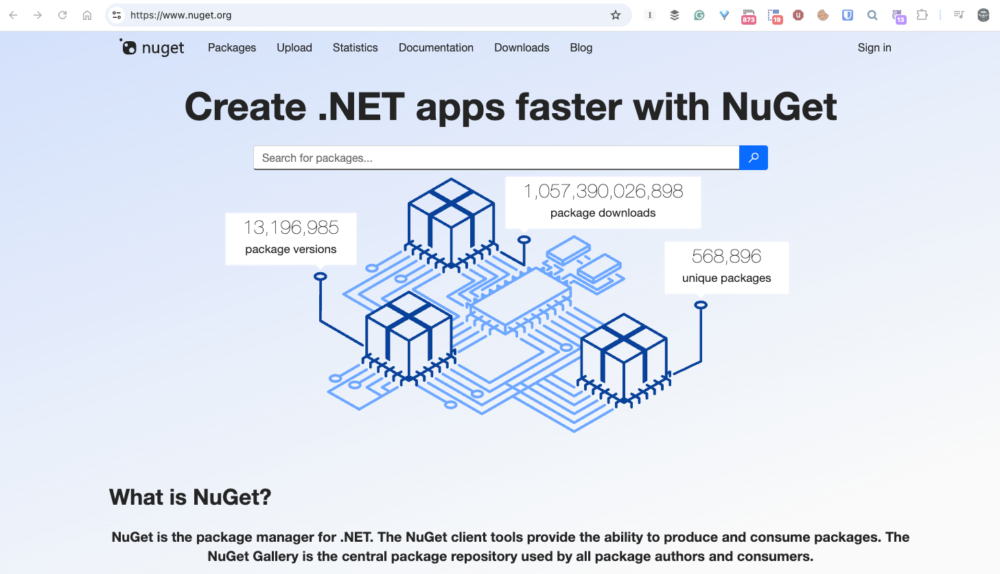
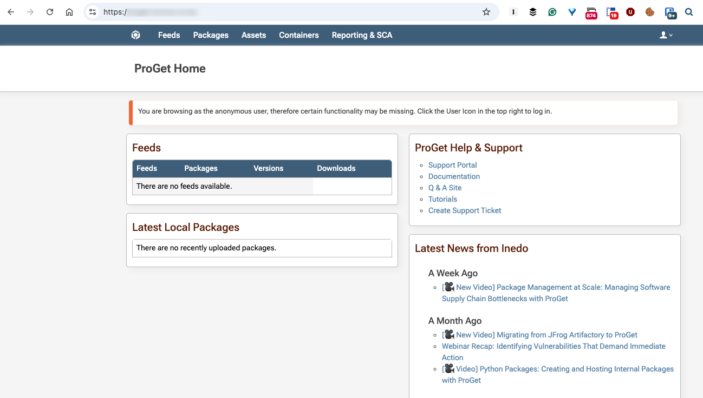
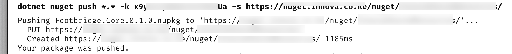

If you are working on the .NET platform, you will undoubtedly have used [nuget](https://learn.microsoft.com/en-us/nuget/what-is-nuget), the [package manager](https://en.wikipedia.org/wiki/Package_manager) to **add**, **remove**, and otherwise **manage** third-party libraries in your applications.

Typically, you'd be using the online repository, [nuget.org](https://www.nuget.org/)



You typically would interact with this with your **IDE** or the **command line**, like so:

```c#
dotnet add package Dapper
```

You can also use a third-party repository, which you would typically use in a team setting.

There are several options, such as [Azure](https://learn.microsoft.com/en-us/azure/devops/artifacts/get-started-nuget?view=azure-devops), [TeamCity](https://www.jetbrains.com/help/teamcity/using-teamcity-as-nuget-feed.html), [GitLab](https://docs.gitlab.com/user/packages/nuget_repository/), [GitHub](https://docs.github.com/packages/working-with-a-github-packages-registry/working-with-the-nuget-registry), and [ProGet](https://inedo.com/proget).

I have used **ProGet** for some time myself.



It

You can also add packages to **ProGet**, or any other repository, using the [dotnet nuget tool](https://learn.microsoft.com/en-us/dotnet/core/tools/dotnet-nuget-push).

Take the following example:

```bash
dotnet nuget push *.* -k YOUR_KEY_HERE -s https://YOUR_REPOSITORY PATH HERE/
```

Here we are doing the following:

- `dotnet nuget push` invokes the tool
- `*.*` indicates we want to push **all the files in the current directory**
- `-k` indicates the **API key** to use to authenticate against the repository
- `-s` indicates the **source**, or where the repository is

If everything is in order, you should see something like this:



### TLDR

**The `dotnet nuget` tool allows you to push packages to any package repository**

Happy hacking!
