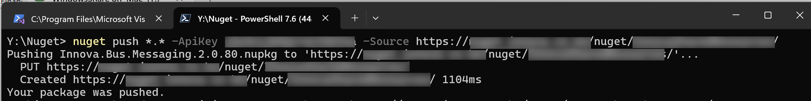

In a previous post, "[Pushing NuGet Packages To An Online Repository with dotnet nuget]()", we looked at how to use the [dotnet nuget](https://learn.microsoft.com/en-us/dotnet/core/tools/dotnet-nuget-push) tool to **upload packages** to a repository.

In this post, we will look at an alternative tool for this purpose - the [NuGet client](https://learn.microsoft.com/en-us/nuget/install-nuget-client-tools?tabs=macos).

You would typically use this if:

1. You are on the [Windows](https://www.microsoft.com/en-us/windows) platform
2. You are still generating and consuming [.NET Framework](https://en.wikipedia.org/wiki/.NET_Framework) packages
3. You are working with [non-SDK](https://learn.microsoft.com/en-us/nuget/resources/check-project-format) projects

You can download it here: https://dist.nuget.org/win-x86-commandline/latest/nuget.exe

Then add it to your `PATH` to simplify things, or put it in a location that is already in your `PATH`.

Then you can use it like this:

```bash
nuget push *.* -ApiKey x9y5nijN5QzYoCfKEXUa -Source https://nuget.innova.co.ke/nuget/InnovaSharedResources/
```

Here, we are doing the following:

- `nuget push` invokes the NuGet client
- `*.*` indicates we want to push **all the files in the current directory**
- `-ApiKey` indicates the **API key** to use to authenticate against the repository
- `-Source` indicates the **source**, or where the repository is

If everything is in order, you should see the following:



### TLDR

**You can use the `NuGet` client to publish changes to a NuGet repository.**

Happy hacking!
