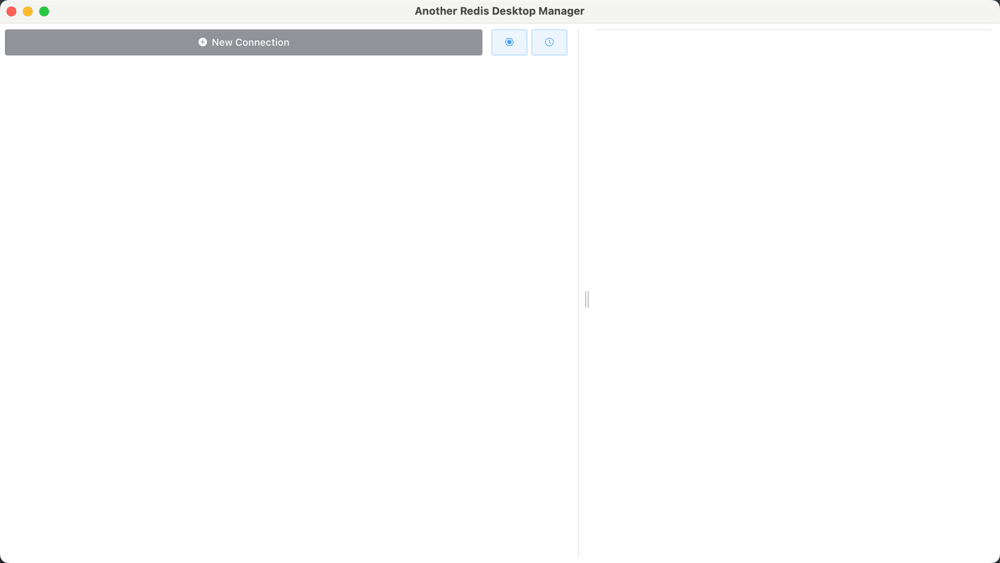
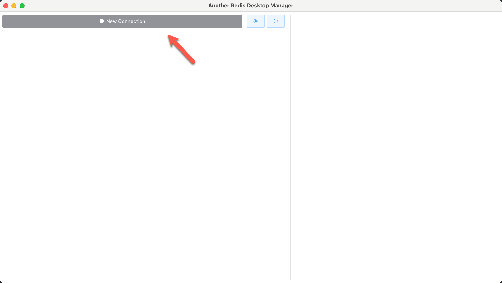
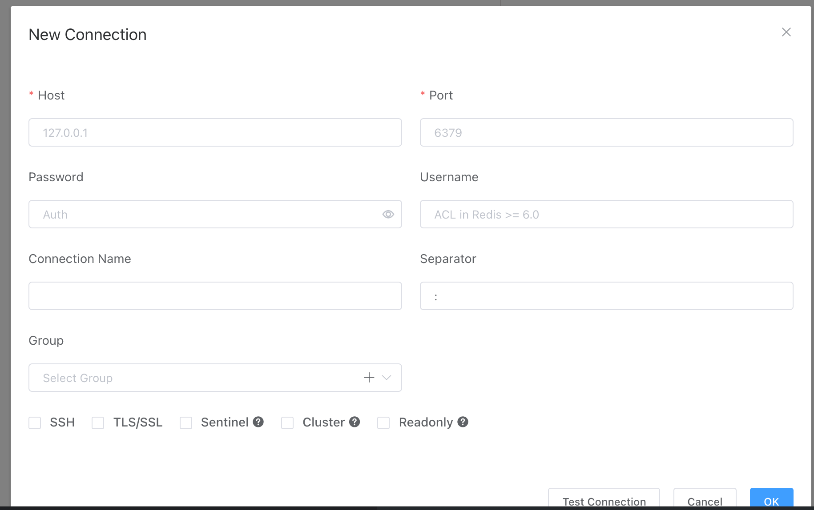
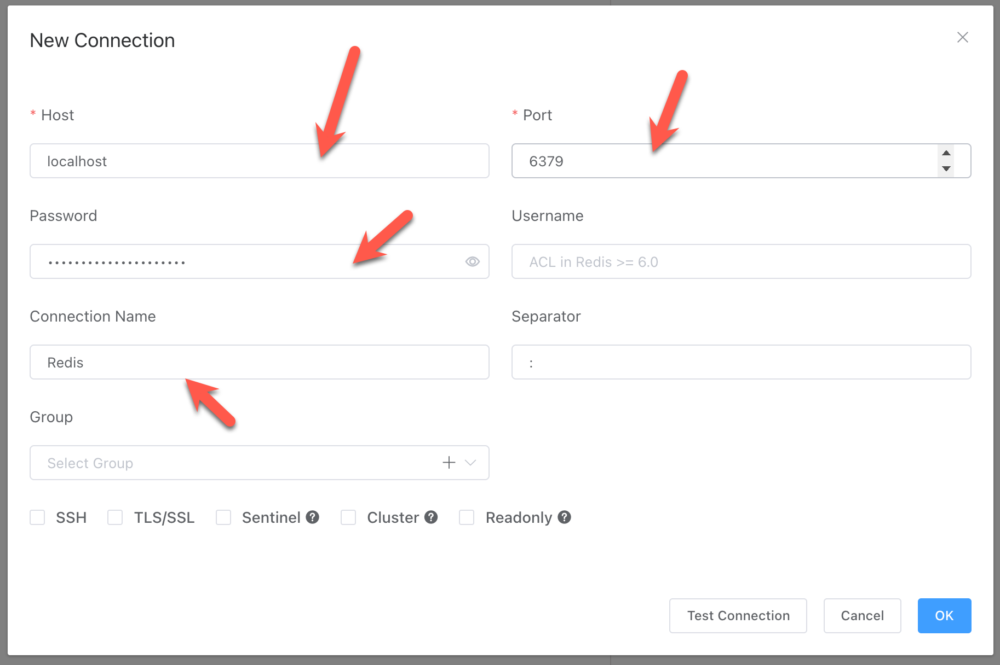
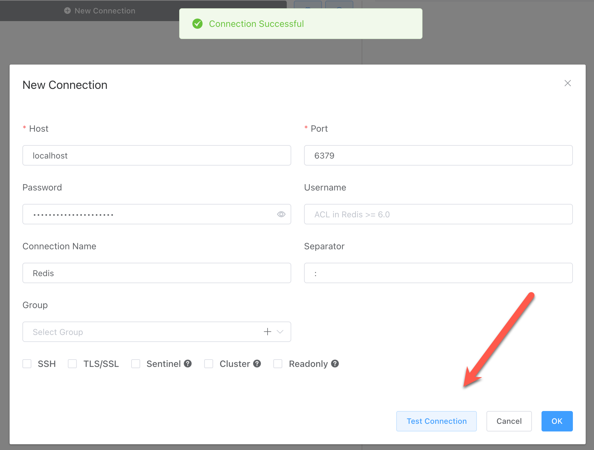
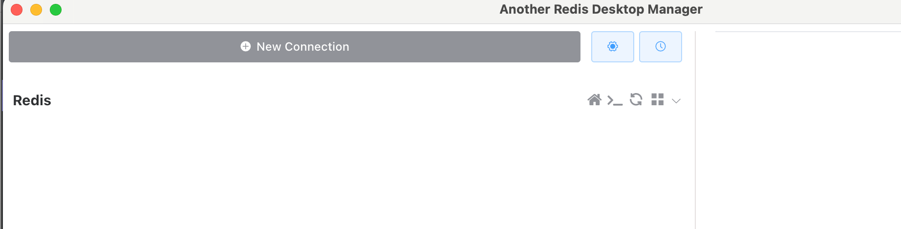
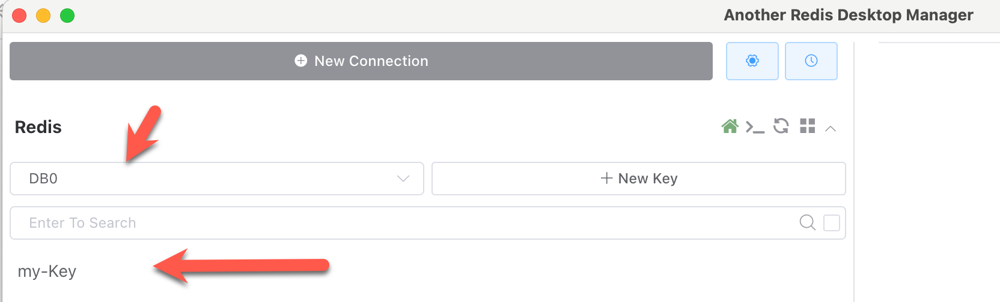
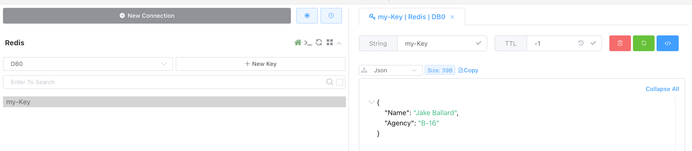

In a previous post, "[Storing Data In Redis With Command Line]()", we looked at how to setup a [Redis](https://redis.io/) image for **cache** purposes, and how to **connect** to it, **insert**  and **retrieve** data.

In this post we will look at how to use [Another Redis Desktop Manager](https://goanother.com/).

This is a **smaller**, **nimbler** tool than [DataGrip](https://www.jetbrains.com/datagrip/) as its **only purpose** is to connect to **Redis**, unlike **DataGrip** that is a **general** database manager.

We begin by [downloading](https://goanother.com/#download) and **installing** to software.

Once launched, you should see the following screen.

Click **New Connection**.

You will get the following dialog to supply connection **parameters**.

Go on and provide the parameters - **host**, **port** and **password**, as well as a connection **name**.

Once supplied, you can **test** the connection.

Click **OK** to complete.

You will now see your new connection.

Click on the connection.

It will expand to show you the **available database(s)**, in this case `DB0` and your **key**.

If you **click** the **key**, you will see your **data**.

### TLDR

**Another Redis Desktop Manager is an excellent tool to view and manage your Redis data.**

Happy hacking!
