In our previous post, "[Storing Data In Redis With Command Line]()", we looked at how to setup a [Redis](https://redis.io/) image for **cache** purposes, and how to **connect** to it, **insert**  and **retrieve** data.

In this post we will look at how to use my go-to database tool, [JetBrains](https://www.jetbrains.com/) [DataGrip](https://www.jetbrains.com/datagrip/), to **view** and **manage** data stored in **Redis**.

First, [download](https://www.jetbrains.com/datagrip/download/), **install** and then **launch** software.

Our next step is to **configure** it to **understand** and **connect** to **Redis**.

From the main menu, go to the **Data Sources** menu.

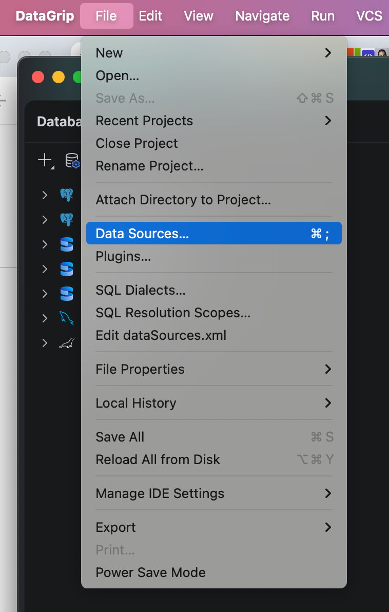

From there, click the **Drivers** icon:

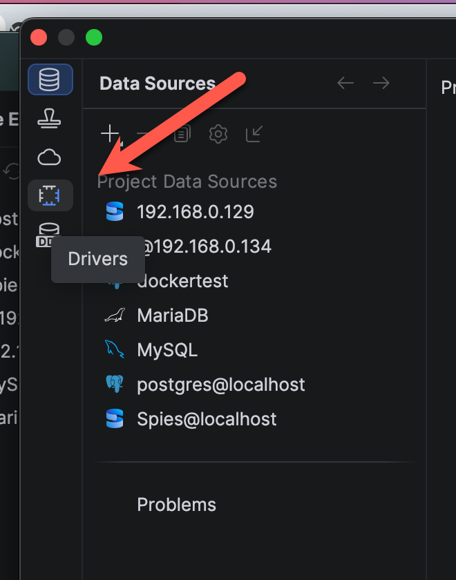

You will be presented with a list of **supported drivers** from a number of databases.

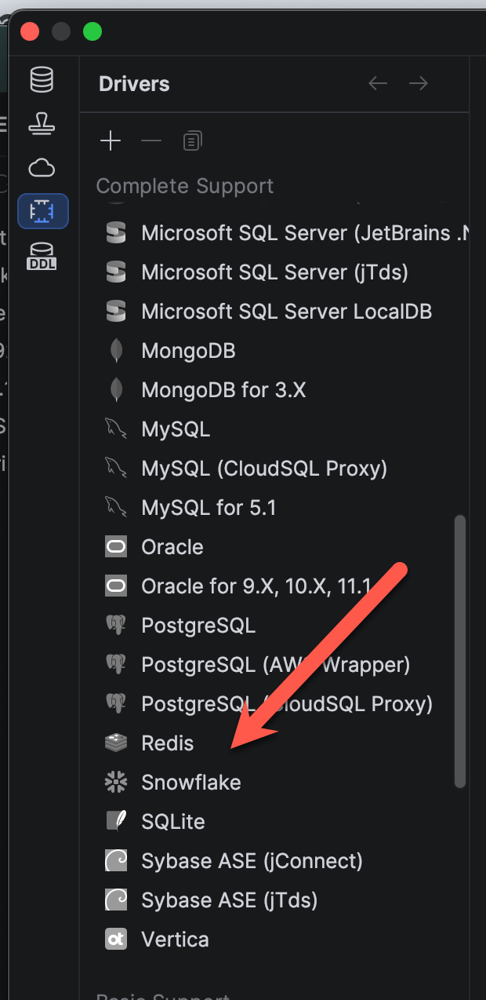

Choose **Redis**.

Proceed to choose the **latest stable** version.

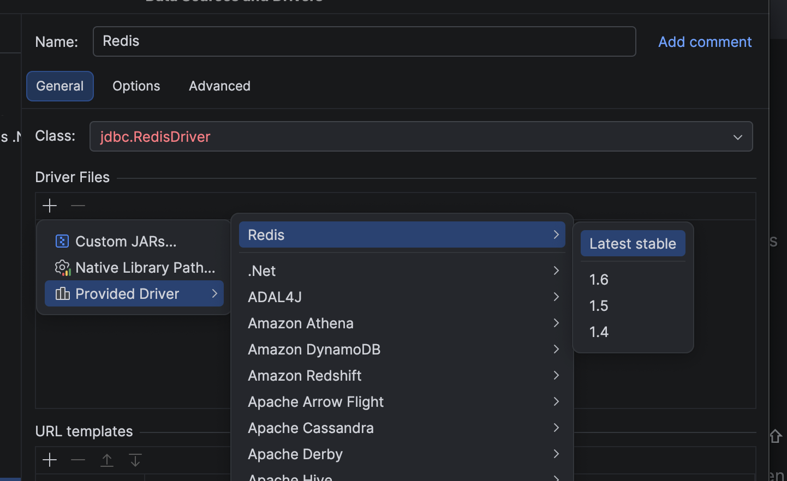

We then switch to the driver we want to use by clicking the option '**Switch to ver 1.6.**'

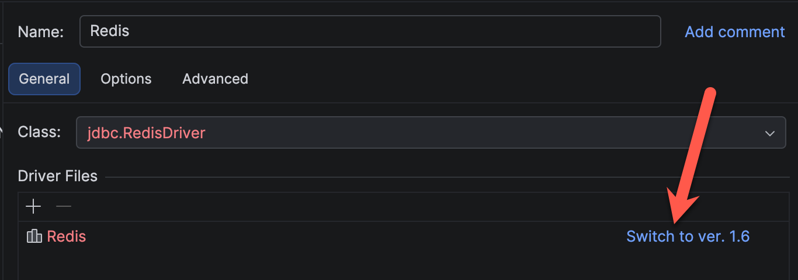

The screen should now look like this:

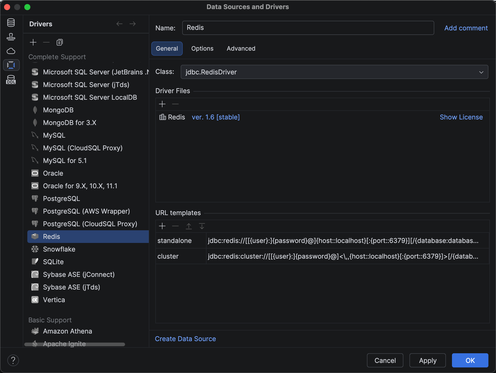

Now we are ready to **connect**.

From the main screen, the **Database Explorer**, click the icon to create a **new connection**.

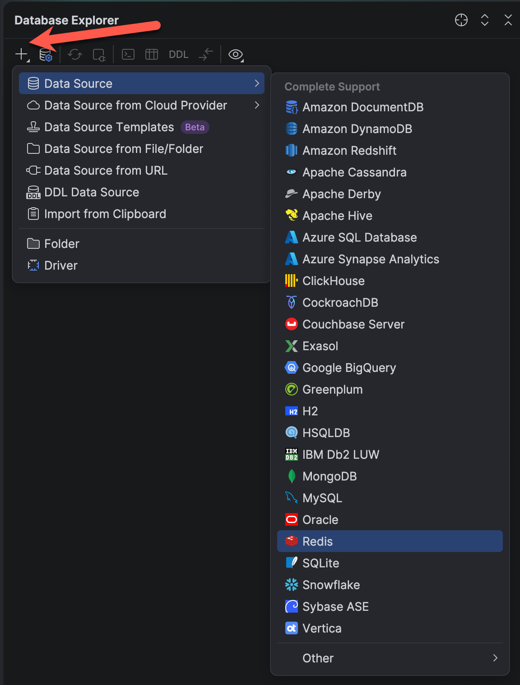

Choose **Redis**.

This will take you to a screen to **configure** your database connection.

For **Redis**, this is typically the **port** and **password**.

If you used the `docker-compose.yaml` from my [previous post](), the **password** is `YourStrongPassword123`. The **port** is the default,  `6379`.

You can **test** the connection to ensure all is well:

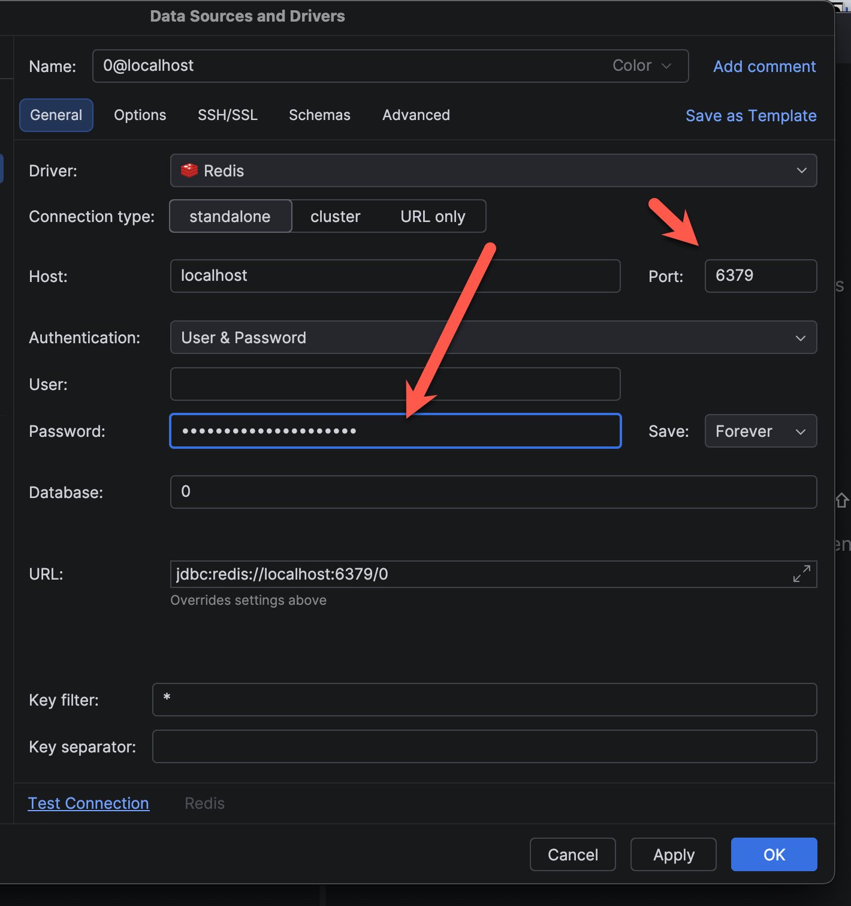

You should see the following dialog:

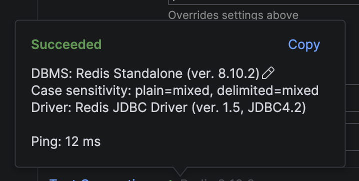

Our connection should be **ready** to browse.

Expand the **keys** from the top level, usually a database named `0`.

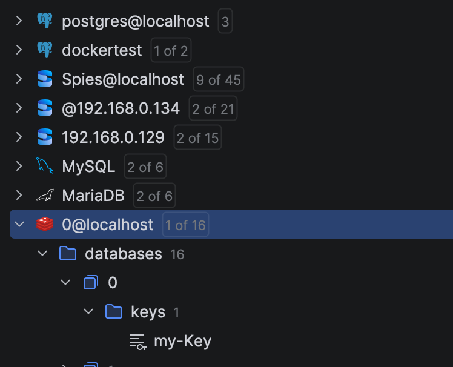

We can see our key, `my-Key` is available.

**Double click** to view the data.

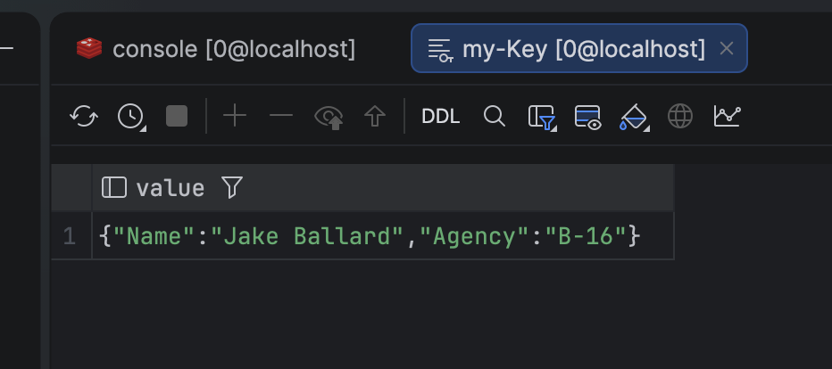

### TLDR

**JetBrains DataGrip can be used to view Redis data.**

Happy hacking!
