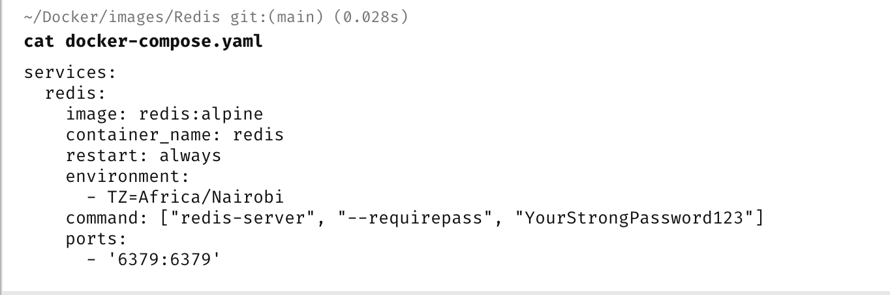
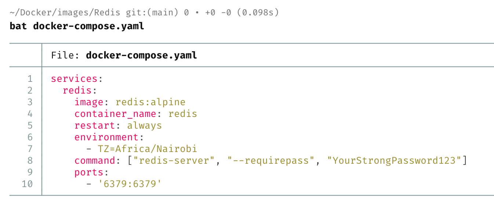

**Viewing file contents** while in the terminal is something that you will probably do quite often.

And the goto for this is usually the [cat](https://www.akamai.com/cloud/guides/linux-cat-command) command.

For example in the terminal, if you wanted to view the **contents** of the file `docker-compose.yaml`, you would do it like this:

```bash
cat docker-compose.yaml
```

Which would yield the following:



A better tool for this is the cross-platform [bat](https://github.com/sharkdp/bat).

[Install](https://github.com/sharkdp/bat#installation) it using whichever option is appropriate. 

Once it is installed, it is a drop-in replacement for cat.

```bash
cat docker-compose.yaml
```

This will yield the following:



The differences are:

1. The viewer is **file-type aware** and can **colour** the contents appropriately
2. **Line numbers** are visible.

This is much easier to view and interact with.

### TLDR

**Use `bat`, a replacement for `cat`, for viewing files in the terminal.**

Happy hacking!
