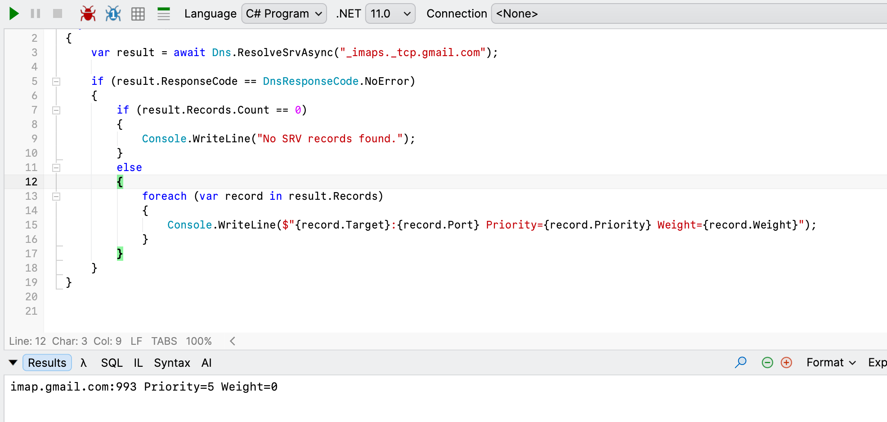

In a previous post, ".NET 11 Preview - Native DNS Record Resolving", we saw how .NET 11 can now do DNS record resolving natively.

As of the preview, this was only supported on **Windows**, but not on **Linux**, **macOS** or **Unix**.

This has now been addressed as of [release candidate 1](https://github.com/dotnet/core/discussions/10569).

The example from before:

```c#
var result = await Dns.ResolveSrvAsync("_imaps._tcp.gmail.com");

if (result.ResponseCode == DnsResponseCode.NoError)
{
  if (result.Records.Count == 0)
  {
  	Console.WriteLine("No SRV records found.");
  }
  else
  {
    foreach (var record in result.Records)
    {
    	Console.WriteLine($"{record.Target}:{record.Port} Priority={record.Priority} Weight={record.Weight}");
    }
  }
}
```

Now runs.



### TLDR

**DNS record resolving now works in Linux, macOS and Unix.**

Happy hacking!
