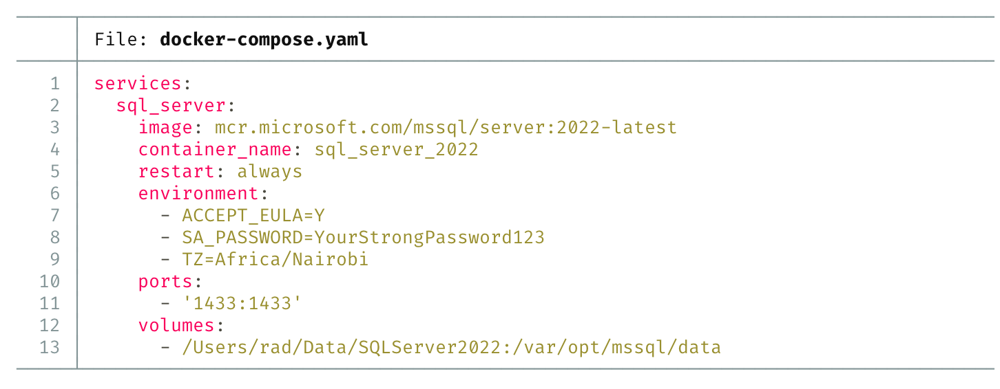
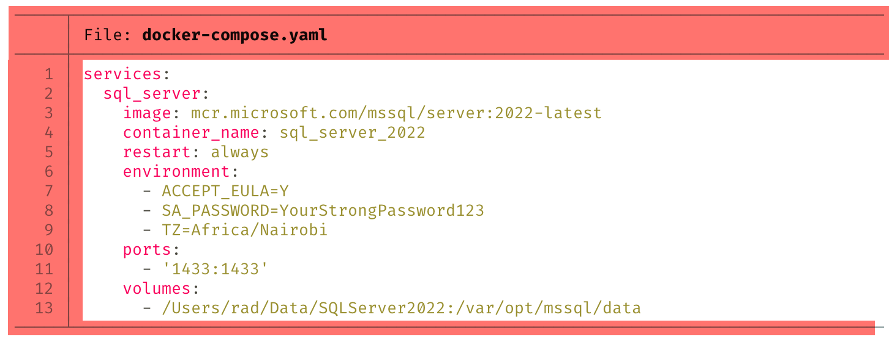
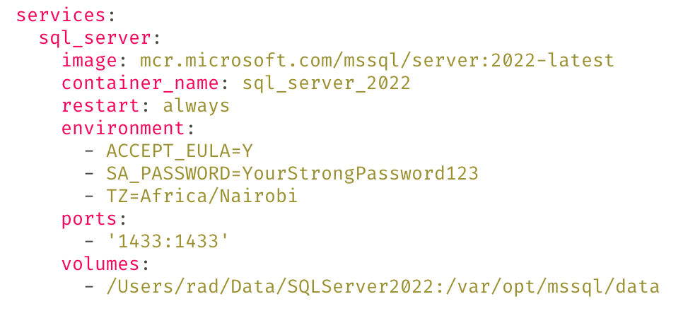

In a previous post, "[Viewing Files In The Terminal Using Bat]()", we looked at how to **view files** in the **terminal** using the utility [bat](https://github.com/sharkdp/bat), the **better** alternative to the [cat](https://www.akamai.com/docs/guides/linux-cat-command/) utility.

A sample file, `docker-compose.yaml`, looks like this:



However, that colour coded view, with **line numbers**, can sometimes be **problematic** if you need to **copy** and **paste** from this view.

The solution to this is the `-p` parameter.

```bash
bat docker-compose.yaml -p
```

This presents the file without these **artifacts**:



It therefore now looks like this:



Here, we have the benefit that the display is colour coded but you can now freely copy the text.

### TLDR

The `bat` parameter `-p` allows you to view files without artifacts.
