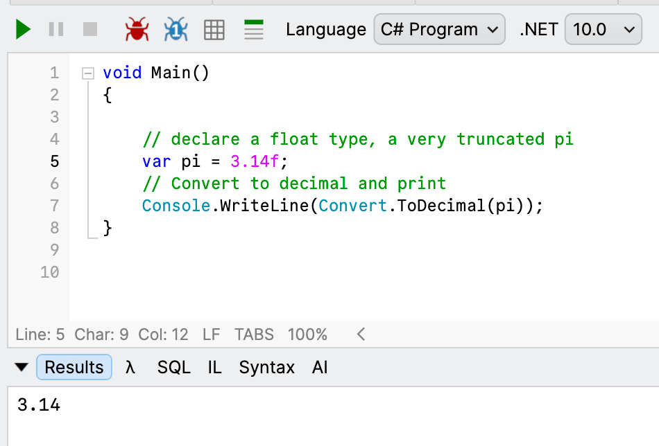
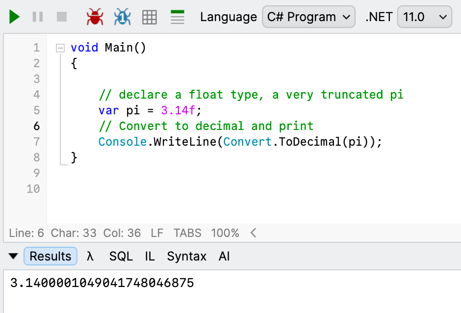

**Conversion** between **numeric types** is a necessary evil, especially when dealing with [approximate types](https://learn.microsoft.com/en-us/dotnet/csharp/language-reference/builtin-types/floating-point-numeric-types).

Take this simple example:

```c#
// declare a float type, a very truncated pi
var pi = 3.14f;
// Convert to decimal and print
Console.WriteLine(Convert.ToDecimal(pi));
```

You would expect this to print `3.14`.

Which **it does**.



At least currently in **.NET 10**.

In .NET 11 **release candidate 1**, however, **this has changed**.

The runtime will [attempt to convert the value to its nearest approximation](https://github.com/dotnet/runtime/pull/130565).



Note the difference!

This can **break existing code** that is re-compiled under **.NET 11** so I hope your **unit** and **integration** tests have some good coverage!

I bet you're thinking there will be a flag to turn this off.

[There won't be](https://github.com/dotnet/docs/issues/55743)!

Happy hacking!
