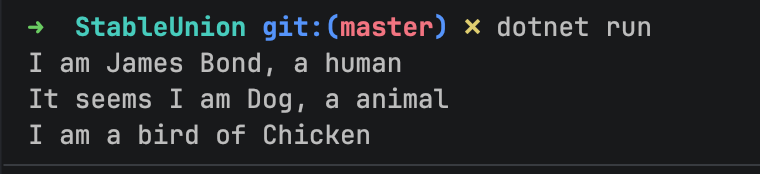

In a previous post, "[.NET 11 Preview - Discriminated Unions Support]()", we looked at the support for discriminated [union](https://learn.microsoft.com/en-us/dotnet/csharp/language-reference/builtin-types/union) types in .NET.

To recap. let us declare some `types`:

```c#
public record class Human(string Name);

public record class Animal(string Name, int Legs);

public record class Bird(string Name, int Wings);
```

We want to write a **method** that can **greet** any of these `types`.

This is where the `union` comes into play:

```c#
public union LivingThing(Human, Animal, Bird);
```

Then we write our **method**:

```c#
string Greet(LivingThing livingThing)
{
    return livingThing switch
    {
        Human human => $"I am {human.Name}, a human",
        Animal animal => $"It seems I am {animal.Name}, a animal",
        Bird bird => $"I am a bird of {bird.Name}"
    };
}
```

Finally, create some `types` and **invoke** our method:

```c#
var man = new Human("James Bond");
var chicken = new Bird("Chicken", 2);
var dog = new Animal("Dog", 2);

Console.WriteLine(Greet(man));
Console.WriteLine(Greet(dog));
Console.WriteLine(Greet(chicken));
```

This works as expected.



This feature was a [preview](https://github.com/dotnet/designs/blob/main/accepted/2021/preview-features/preview-features.md), and required the following entry in your `.csproj` project file:

```xml
<LangVersion>preview</LangVersion>
```

As of the release candidate, t**his is no longer required**, as `unions` now are **fully** supported features.

### TLDR

**`Unions` are now native supported in .NET 11.**

The code is in my GitHub.

Happy hacking!
