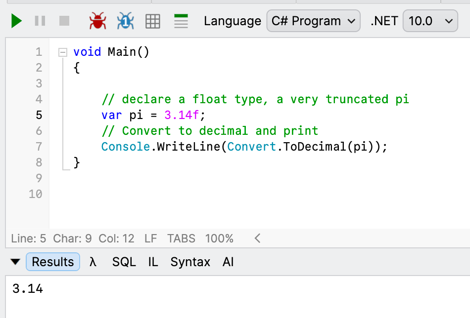
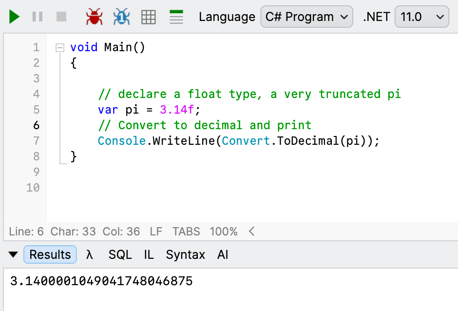
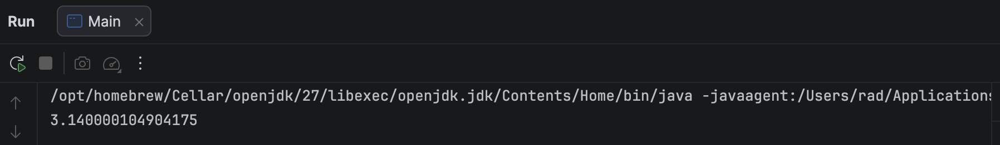

In a previous post, "[.NET 11 Release Candidate - Breaking Change - Numeric Conversion Rounding]()", we looked at a breaking change in .NET where `float` conversions to `decimal` were first taken to the nearest **approximation** before **conversion**.

As a recap, the prior behaviour in **.NET 10 and earlier** was this:



And the **new** behaviour in **.NET 11** was this:



I got to wondering how [Java](https://www.java.com/) handles this.

The code is as follows:

```java
void main() {
  // Declare a float type, a very truncated pi
  var pi = 3.14f;

  // Convert to BigDecimal and print
  IO.println(BigDecimal.valueOf(pi));
}

```

The equivalent of [Decimal](https://learn.microsoft.com/en-us/dotnet/api/system.decimal?view=net-10.0) in **Java** is [BigDecimal](https://docs.oracle.com/javase/8/docs/api/java/math/BigDecimal.html).

The code runs as follows:



It would seem that **Java already has this behaviour**.

### TLDR

***Java* already approximates float values prior to conversion.**

Happy hacking!
