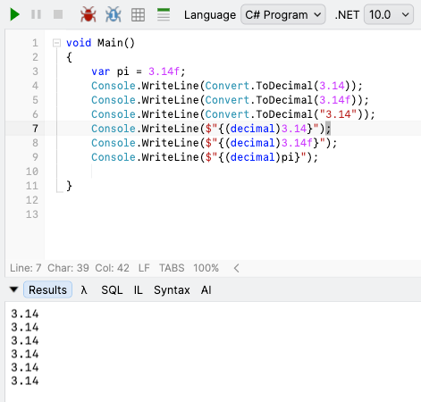
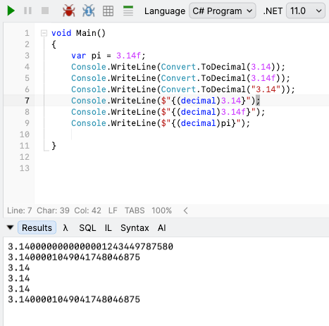

In a prior post, "[NET 11 Release Candidate - Breaking Change - Numeric Conversion Rounding]()", we looked at a potentially **breaking issue** with [rounding](https://en.wikipedia.org/wiki/Rounding) before type conversions.

Which made me curious.

There are **several** ways to represent a `float` as a `decimal`.

1. Using [Convert.ToDecimal](https://learn.microsoft.com/en-us/dotnet/api/system.convert.todecimal?view=net-10.0) directly with the **value**
2. Using [Convert.ToDecimal](https://learn.microsoft.com/en-us/dotnet/api/system.convert.todecimal?view=net-10.0) with a **variable** of `float` type
3. [Casting](https://learn.microsoft.com/en-us/dotnet/csharp/programming-guide/types/casting-and-type-conversions) the **value** directly
4. **Casting** a **variable** of `float` type

Here is the code we want to test:

```c#
var pi = 3.14f;
Console.WriteLine(Convert.ToDecimal(3.14));
Console.WriteLine(Convert.ToDecimal(3.14f));
Console.WriteLine(Convert.ToDecimal("3.14"));
Console.WriteLine($"{(decimal)3.14}");
Console.WriteLine($"{(decimal)3.14f}");
Console.WriteLine($"{(decimal)pi}");
```

To mix things up, we are including a `double` and a `string` representation.

If we run this under .**NET 10**, the results are as follows:




If we run the same code under **.NET 11**, the results are as follows:



A couple of things of interest:

1. The .NET 11 change seems to affect all **approximate types** - `float`, `double`
2. `String` representations are **preserved** as-is.
3. The approximation is **not done** when casting **values**

### TLDR

**If your code is doing any conversions using `Convert` or *casting*, you might want to prepare unit tests to ensure you have no surprises when you upgrade.**

Happy hacking!
