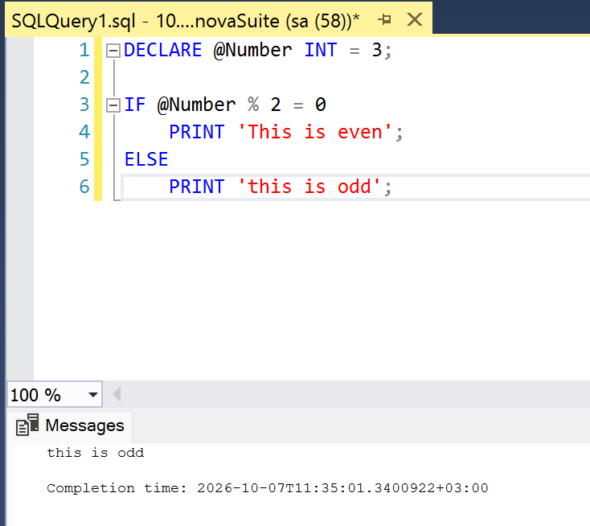
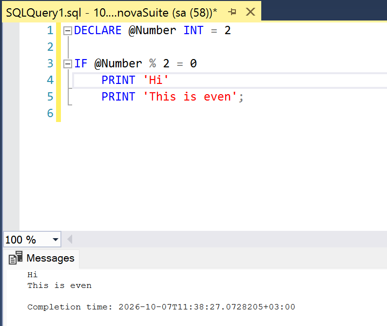
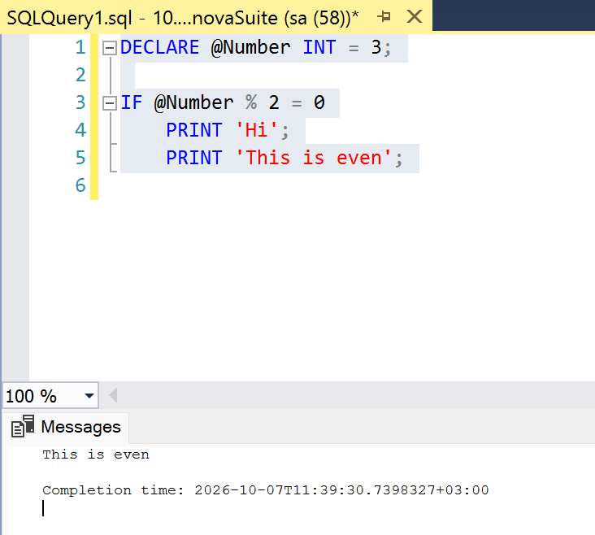

One thing that still occasionally trips me up, even today, is [statement blocks](https://learn.microsoft.com/en-us/sql/t-sql/language-elements/begin-end-transact-sql?view=sql-server-ver17) in [Microsoft SQL Server](https://www.microsoft.com/en-us/sql-server) [T-SQL](https://learn.microsoft.com/en-us/sql/t-sql/language-reference?view=sql-server-ver17).

I will explain with an example.

Take this code:

```sql
DECLARE @Number INT = 3;

IF @Number % 2 = 0
    PRINT 'This is even';
ELSE
    PRINT 'This is odd';
```

This, unsurprisingly, will print the following:



Now, let us make a slight **modification**:

```sql
DECLARE @Number INT = 2

IF @Number % 2 = 0
	PRINT 'Hi'
    PRINT 'This is even';

```

This will print the following:



Which looks ok.

You only realize there is a problem when we change `@Number` to `3`

```sql
DECLARE @Number INT = 3;

IF @Number % 2 = 0
    PRINT 'Hi';
		PRINT 'This is even';

```



This is now blatantly **not true**!

The problem is that the `IF` construct only operates with a **single statement block**.

**A single line is a statement block.**

**Any additional line is not considered to be part of that statement block.**

To tell SQL Server what you mean, you must wrap multiple lines in a `begin ... end` block.

Like so:

```sql
DECLARE @Number INT = 3;

IF @Number % 2 = 0
    BEGIN
        PRINT 'Hi';
        PRINT 'This is even';
    END;

```

This now prints nothing, as expected.

### TLDR

**SQL Server statement blocks can trip you up if you are not careful, leading to very subtle bugs in your procedures and functions.**

Happy hacking!
