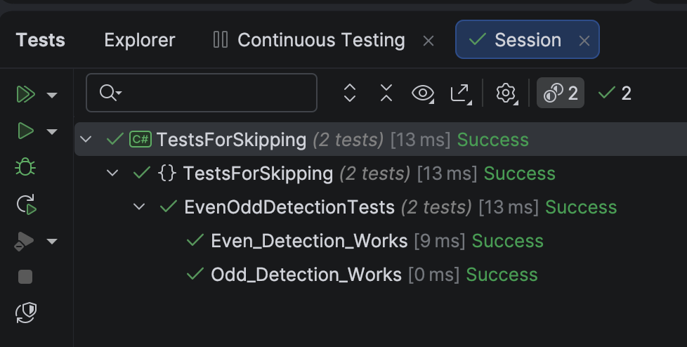
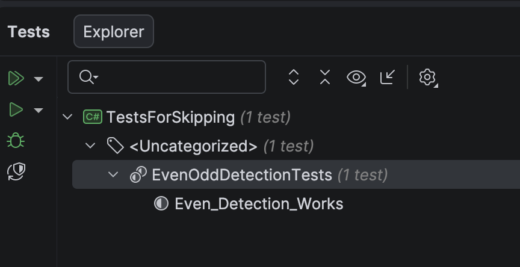
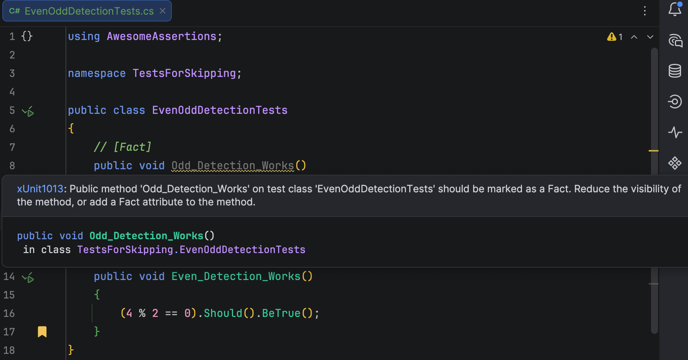
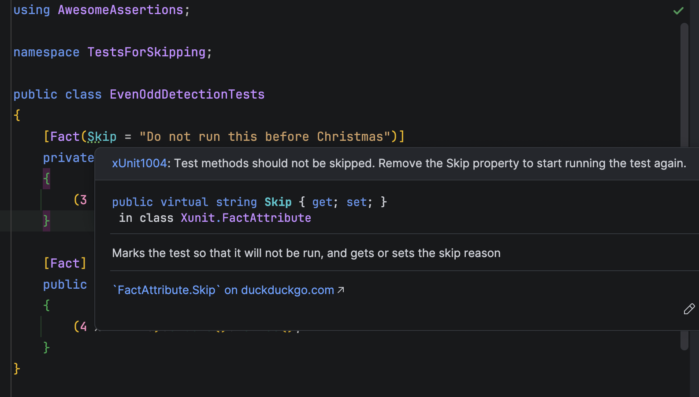

If you work in the [.NET](https://dotnet.microsoft.com/en-us/) ecosystem, you are likely using [xUnit](https://xunit.net/) as your testing framework, and (my personal preference) [AwesomeAssertions](https://awesomeassertions.org/) as your test assertion framework.

As a simple (unrealistic!) example, suppose we wanted to test the algorithm for [modulo division](https://en.wikipedia.org/wiki/Modulo) with single values.

**(It is unrealistic as you would not do it this way in production!)**

Your tests would look something like this:

```c#
public class EvenOddDetectionTests
{
    [Fact]
    public void Odd_Detection_Works()
    {
        (3 % 2 != 0).Should().BeTrue();
    }

    [Fact]
    public void Even_Detection_Works()
    {
        (4 % 2 == 0).Should().BeTrue();
    }
}
```

If we run these tests, they should pass.



Now suppose, for whatever reason, we wanted to **skip** one of these tests.

There are a couple of options available to us here:

## Comment Out The Test

The not-so-subtle option is to **comment out the test code**.

```c#
public class EvenOddDetectionTests
{
    // [Fact]
    // public void Odd_Detection_Works()
    // {
    //     (3 % 2 != 0).Should().BeTrue();
    // }

    [Fact]
    public void Even_Detection_Works()
    {
        (4 % 2 == 0).Should().BeTrue();
    }
}
```

Since there is literally no code, the **test runner doesn't see it**.



The main problem with this is that **you will forget to uncomment** it when you need it back.

## Remove the `Fact` Attribute

The other alternative is to remove the `[Fact]` attribute so the test runner doesn't see it.

```c#
public class EvenOddDetectionTests
{
    // [Fact]
    public void Odd_Detection_Works()
    {
        (3 % 2 != 0).Should().BeTrue();
    }

    [Fact]
    public void Even_Detection_Works()
    {
        (4 % 2 == 0).Should().BeTrue();
    }
}
```


This is **slightly better** than the previous approach because the **IDE will warn you about this**.



Here we can see what my IDE of choice, [JetBrains](https://www.jetbrains.com/) [Rider](https://www.jetbrains.com/rider/), will tell you.

## `[Skip]` Attribute

**xUnit** has an attribute specifically for this scenario: [Skip].

You pass it the **reason** that you want to skip the test.

```c#
public class EvenOddDetectionTests
{
    [Fact(Skip = "Do not run this before Christmas")]
    private void Odd_Detection_Works()
    {
        (3 % 2 != 0).Should().BeTrue();
    }

    [Fact]
    public void Even_Detection_Works()
    {
        (4 % 2 == 0).Should().BeTrue();
    }
}
```

This is the best solution for a number of reasons:

1. It **communicates clearly** that you meant to skip the test, and it was not an oversight
2. You **explain why it is being skipped** for the benefit of anyone else maintaining that code
3. The **IDE will warn** about the skipping



So you have the best of both worlds.

### TLDR

**You can skip unit tests by decorating them with the `Skip` attribute.**

The code is in my [GitHub](https://github.com/conradakunga/BlogCode/tree/master/2026-09-19%20-%20TestsForSkipping).

Happy hacking!
