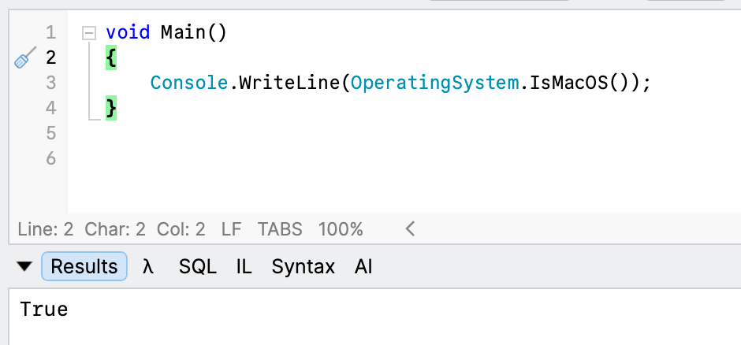

In a previous post, "[Determining The Operating System C# .NET Program Is Running Under]({% post_url 2024-11-23-determing-the-operating-system-c-program-is-running-under %)", we looked at how to extract information about the **operating system the code is running under**.

There were a lot of candidate APIs

- [Environment.OSVersion.Platform](https://learn.microsoft.com/en-us/dotnet/api/system.environment.osversion?view=net-10.0)
- [RuntimeInformation.IsOSPlatform](https://learn.microsoft.com/en-us/dotnet/api/system.runtime.interopservices.runtimeinformation.isosplatform?view=net-10.0)

There is actually a much simpler API if all you need is a quick check of whether the OS is [macOS](https://en.wikipedia.org/wiki/MacOS).

```c#
void Main()
{
	Console.WriteLine(OperatingSystem.IsMacOS());
}
```

This, unsurprisingly, returns `true` or `false`, depending on where you are running.



If you need more **granular** checks, the other APIs mentioned earlier might be beneficial.

### TLDR

**`OperatingSystem.IsMacOS()` will tell you that your code is running on macOS.**

Happy hacking!
