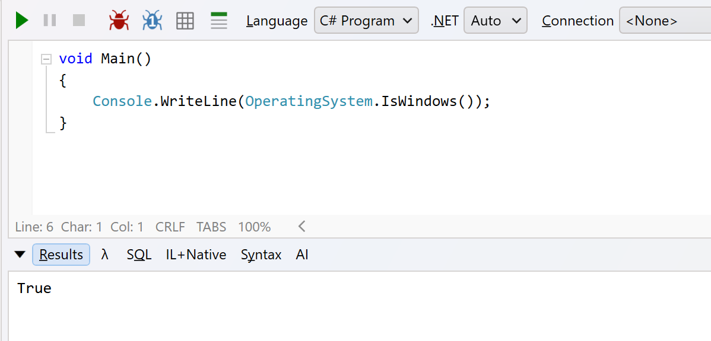

In a previous post, "[Checking If the Operating System Is Linux in C# & .NET]()", we looked at a simple API to check if the operating system is [Linux](https://en.wikipedia.org/wiki/Linux).

In this post, we'll cover the same for [Windows](https://en.wikipedia.org/wiki/Microsoft_Windows).

Unsurprisingly, the API is [OperatingSystem.IsWindows()](https://learn.microsoft.com/en-us/dotnet/api/system.operatingsystem.iswindows?view=net-10.0):

```c#
void Main()
{
  Console.WriteLine(OperatingSystem.IsWindows());
}
```

This will print the following if running on **Windows**.



This just checks whether the underlying operating system is Windows. For more **granular** details, there are other APIs that you can turn to.

### TLDR

**You can use `OperatingSystem.IsWindows()` to check if your code is running on Windows.**
